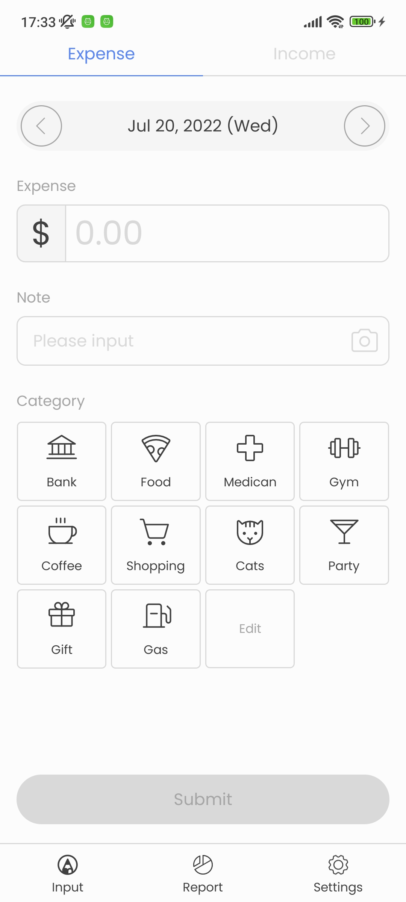
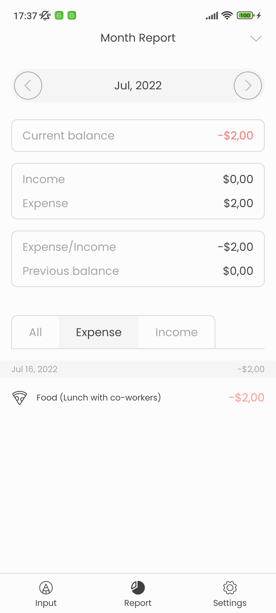
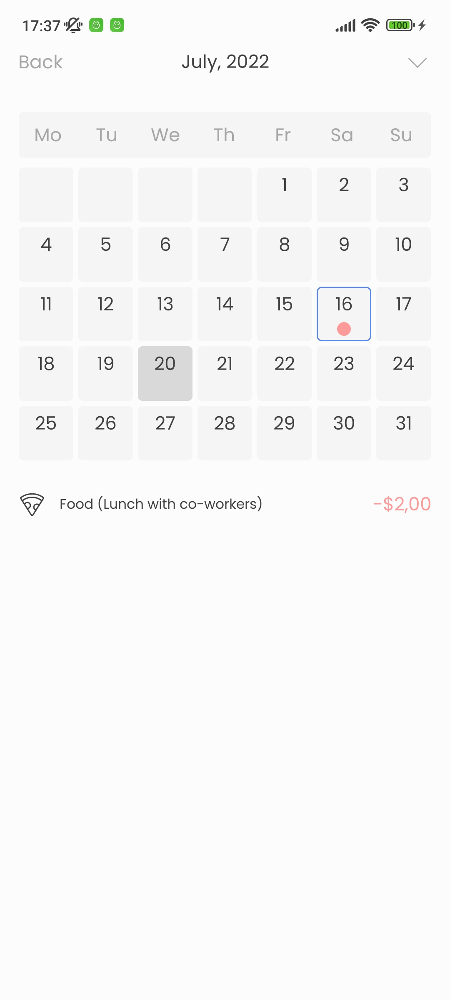
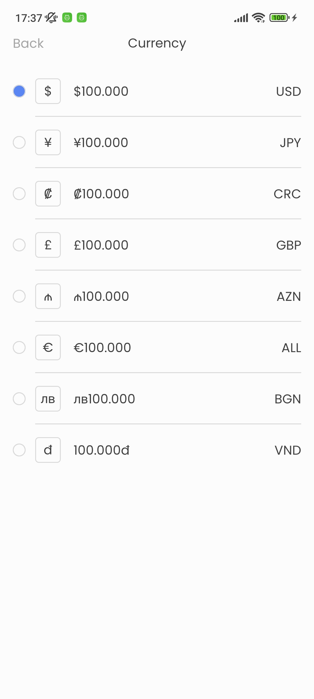
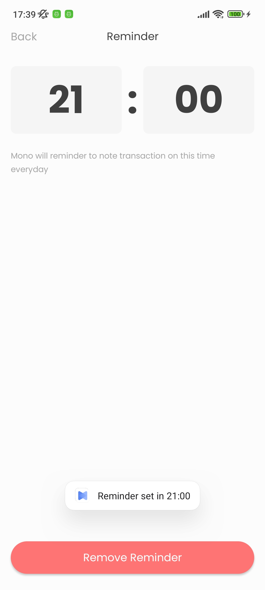

# Money Notes Application for Android

_Mono is a mobile application for those who like to manage their finances in a simple but time-consuming way with an intuitive and easy-to-use interface._

## Description

Mono is a mobile application for those who like to manage their finances in a simple but time-consuming way with an intuitive and easy-to-use interface.

### Problems

Many times we wonder why we lost money or what we used them for and synthesizing them would be extremely complicated.

- _Forget what expense for._
- _Difficult to compare between months, weeks, ..._
- _Takes time to find the bill was paid_
- _and a lot of money management problems_

### Solutions

Mono app provides users with convenient features in managing money for expenses/income as well as weekly, monthly and more.

- _Easily check transactions in the report section._
- _Easily view week, month changes in the filter._
- _Mono has integrated the ability to add images into a transaction_
- _with a minimalistic, intuitive interface and more._

# Screenshoot

  
  
  

  
  
  

## Requirement

Android SDK >= 26 (Android 8.0)

## Authors

[@hieubui00.it](https://github.com/hieubui00)

## Version History

- 1.0.0
  - Initial Release
